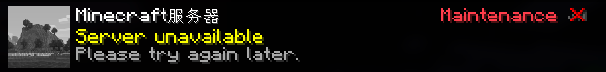
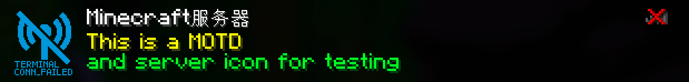

# Mirage

An extremely lightweight Minecraft placeholder server. Designed for the lowest possible resource consumption. 
This allows clients to see the configured content in the server list when your server is in a special state
(such as maintenance or curfew).

When attempting to connect, it immediately displays a message and disconnects the player.

## Usage

```sh
cargo build --release
./target/release/Mirage
```

## Performance

- Maximum efficiency for a wide range of devices
- Written in Rust
- < 2MB RSS under normal load
- negligible CPU overhead
- High concurrency support
- No memory accumulation after requests end

## Display

|                                        |
|----------------------------------------|
|      |
|  |

## Configuration

The configuration file is stored in the same directory as the executable. It is created when there is no `mirage.json` file.

| Field               | Purpose                                                                                   |
|---------------------|-------------------------------------------------------------------------------------------|
| `bind`              | Listening address and port                                                                |
| `proxy_protocol_v2` | PROXY Protocol v2 header compatibility                                                    |
| `version_name`      | Custom version name                                                                       |
| `motd`              | Custom MOTD                                                                               |
| `hover_list`        | Hover text for the player count                                                           |
| `server_icon`       | PNG file path;<br/>Base64 string (`"data:image/png;base64,..."`); <br/>`null` for no icon |
| `disconnect`        | Player disconnect message                                                                 |
